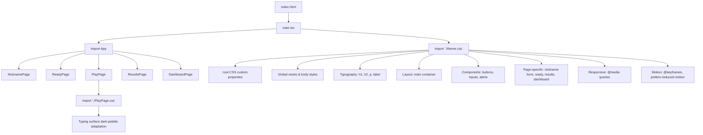

# Design Document: Kiro Theme Frontend

## Overview

This feature applies a cohesive dark-theme visual design to every page of the Typing Game frontend. The approach is deliberately simple: a single global CSS stylesheet (`theme.css`) using CSS custom properties on `:root`, imported once in `main.tsx`. No CSS-in-JS, no preprocessors, no component library — just a well-structured stylesheet that layers on top of the existing HTML.

The theme achieves visual impact through bold color choices (deep navy background, vibrant blue/teal accents), generous whitespace, and a few well-placed accent effects (gradient buttons, subtle glows on focus, fade-in page transitions). The existing `PlayPage.css` is updated in place to adapt the character-state visual treatments to the dark palette while preserving all non-color cues (bold, underline, wavy underline, cursor blink).

All existing HTML structure, `data-testid` attributes, `aria-*` attributes, and `role` attributes remain untouched. The theme is purely a visual layer.

### Key Design Decisions

1. **Single global stylesheet** — One `theme.css` file with CSS custom properties. This keeps the implementation lightweight and easy to reason about. Custom properties enable consistent color usage across all selectors without duplication.

2. **Update PlayPage.css in place** — Rather than moving typing-surface styles into the global sheet, we update the existing file's color values to reference the dark palette. This preserves the well-documented structure and comments already in that file.

3. **CSS-only approach** — No runtime JavaScript for theming. The `<body>` gets its styles from the global sheet; page-specific selectors target existing semantic elements and `data-testid` attributes. This means zero bundle-size impact beyond the CSS file itself.

4. **Accent-driven visual interest** — The design relies on a blue-to-teal gradient for primary buttons, subtle `box-shadow` glows on focus/hover, and a single fade-in animation on `<main>` to create a polished feel without complexity.

## Architecture



### File Changes

| File | Action | Purpose |
|------|--------|---------|
| `frontend/src/theme.css` | **Create** | Global dark theme — custom properties, resets, typography, layout, component styles, page-specific styles, responsive rules, animations, crown animation keyframes |
| `frontend/src/main.tsx` | **Edit** | Add `import './theme.css'` before the App import |
| `frontend/src/pages/PlayPage.css` | **Edit** | Update color values to dark-palette equivalents; preserve all non-color cues and structure |
| `frontend/src/pages/DashboardPage.tsx` | **Edit** | Add previous-top-player tracking via `useRef`, compare rank-1 `playerId` across snapshots, conditionally apply a `crown-glow` CSS class to the rank-1 `<tr>` when a new top player is detected, and auto-remove the class after the animation completes |

No new dependencies are added.

## Components and Interfaces

### CSS Custom Properties (`:root`)

The color palette is defined once on `:root` and referenced throughout both `theme.css` and the updated `PlayPage.css`:

```css
:root {
  /* Backgrounds */
  --bg-primary: #0d1117;
  --bg-surface: #161b22;

  /* Text */
  --text-primary: #e6edf3;
  --text-secondary: #8b949e;

  /* Accents */
  --accent-blue: #58a6ff;
  --accent-teal: #3fb9a0;
  --accent-green: #3fb950;
  --accent-red: #f85149;
  --accent-amber: #d29922;

  /* Borders */
  --border-default: #30363d;
  --border-accent: #58a6ff;

  /* Surfaces */
  --surface-radius: 12px;
}
```

### Stylesheet Sections (theme.css)

The global stylesheet is organized into these logical sections, in order:

1. **Custom Properties** — `:root` color palette and shared values
2. **Reset & Body** — Box-sizing reset, body background/color/font, min-height, font smoothing
3. **Typography** — `h1`, `h2`, `p`, `label` styles with hierarchy
4. **Layout** — `main` centering, max-width, padding
5. **Buttons** — Primary button (gradient pill), disabled state, hover/focus states
6. **Inputs** — Text input dark styling, focus glow
7. **Alerts** — `[role="alert"]` error styling with red left border
8. **Links** — Secondary link styling (anchors, `<a>` elements)
9. **Nickname Page** — Form surface card, vertical stack layout
10. **Ready Page** — Centered content, conflict dialog surface
11. **Results Page** — Stat card grid (`dl > div`), responsive stack
12. **Dashboard Page** — Leaderboard table surface, thead/tbody styling, hover rows
13. **Responsive** — `@media` queries for Breakpoint_Medium (768px) and Breakpoint_Small (640px)
14. **Animations** — `@keyframes fade-in` on `main`, `prefers-reduced-motion` override
15. **Crown Animation** — `@keyframes crown-glow` for the new-top-player celebration; a golden box-shadow pulse that plays once over ~2s then fades. The `.crown-glow` class is applied to the rank-1 `<tr>` by the DashboardPage component. A `prefers-reduced-motion` fallback replaces the glow with a static golden left-border that fades out.

### Crown Animation — DashboardPage Changes

The DashboardPage component needs a small amount of new logic to detect a new top player and trigger the CSS animation. The changes are minimal:

1. **Track previous top player** — A `useRef<string | null>` stores the `playerId` of the rank-1 entry from the previous snapshot. Initialized to `null`.

2. **Detect change** — When a new snapshot arrives and `state.kind` transitions to `"ready"`, compare the new rank-1 `playerId` against the ref. If they differ and the ref is not `null` (i.e., this is not the initial load), set a `crownPlayerId` state value.

3. **Apply CSS class** — The `LeaderboardTable` component receives `crownPlayerId` as a prop. When a row's `entry.playerId === crownPlayerId`, it gets an additional `className="crown-glow"`.

4. **Auto-clear** — An `onAnimationEnd` handler on the row (or a `setTimeout` of ~2s) clears `crownPlayerId` back to `null`, removing the class so the animation doesn't replay on the next poll.

5. **Update ref** — After comparison, the ref is updated to the current rank-1 `playerId`.

This keeps the logic self-contained in the dashboard component with no new files or shared state.

### Crown Animation CSS (in theme.css)

```css
/* Crown animation — new top player celebration (Requirement 12) */
@keyframes crown-glow {
  0% {
    box-shadow: inset 0 0 0 0 rgba(240, 192, 64, 0);
    background-color: transparent;
  }
  15% {
    box-shadow: inset 0 0 20px 4px rgba(240, 192, 64, 0.3);
    background-color: rgba(240, 192, 64, 0.08);
  }
  100% {
    box-shadow: inset 0 0 0 0 rgba(240, 192, 64, 0);
    background-color: transparent;
  }
}

.crown-glow {
  animation: crown-glow 2s ease-out forwards;
}

@media (prefers-reduced-motion: reduce) {
  .crown-glow {
    animation: none;
    border-left: 3px solid #f0c040;
    transition: border-left-color 2s ease-out;
  }
}
```

### PlayPage.css Updates

The existing `PlayPage.css` is updated to swap light-theme colors for dark-palette equivalents:

| Selector | Property | Old Value | New Value |
|----------|----------|-----------|-----------|
| `[data-testid="play-prompt"]` | `background` | `#fbfcfd` | `var(--bg-surface)` |
| `[data-testid="play-prompt"]` | `color` | `#24292f` | `var(--text-primary)` |
| `[data-testid="play-prompt"]` | `border` | `1px solid #d0d7de` | `1px solid var(--border-default)` |
| `.char--pending` | `color` | `#6e7781` | `var(--text-secondary)` |
| `.char--correct` | `color` | `#1a7f37` | `var(--accent-green)` |
| `.char--incorrect` | `color` | `#cf222e` | `var(--accent-red)` |
| `.char--incorrect` | `background-color` | `#ffebe9` | `rgba(248, 81, 73, 0.15)` |
| `.char--current` | `color` | `#0969da` | `var(--accent-blue)` |
| `.char--current` | `background-color` | `#ddf4ff` | `rgba(88, 166, 255, 0.15)` |
| `.char--current` | `border-left` | `2px solid #0969da` | `2px solid var(--accent-blue)` |
| `@keyframes play-cursor-blink` | `border-left-color` | `#0969da` | `var(--accent-blue)` |
| `[data-testid="play-typo-indicator"]` | `background-color` | `#fff8c5` | `rgba(210, 153, 34, 0.15)` |
| `[data-testid="play-typo-indicator"]` | `color` | `#633c01` | `var(--accent-amber)` |
| `[data-testid="play-typo-indicator"]` | `border` | `1px solid #d4a72c` | `1px solid var(--accent-amber)` |

All non-color properties (font-weight, text-decoration, text-underline-offset, border-radius, animation timing, `::before` content) are preserved exactly as-is.

## Data Models

This feature introduces no new data models, API contracts, or state management. It is a pure CSS layer. The only data-like structure is the set of CSS custom properties on `:root`, documented in the Components section above.

### Selector Strategy

Selectors target elements using this priority order:
1. **Element type** — `body`, `main`, `h1`, `h2`, `p`, `label`, `input`, `button`, `table`, `thead`, `tbody`, `tr`, `th`, `td`, `a`, `dl`, `dt`, `dd`
2. **ARIA/role attributes** — `[role="alert"]`, `[role="alertdialog"]`
3. **data-testid attributes** — `[data-testid="play-prompt"]`, `[data-testid="play-typo-indicator"]`, `[data-testid="play-countdown"]`, `[data-testid="results-stats"]`, `[data-testid="dashboard-table"]`
4. **Existing class names** — `.char`, `.char--pending`, `.char--correct`, `.char--incorrect`, `.char--current`

No new class names or IDs are introduced. No existing attributes are modified or removed.

## Error Handling

This feature is a pure CSS layer with no runtime logic, API calls, or state management. There are no error conditions to handle in the traditional sense.

The only defensive considerations are:

1. **CSS custom property fallbacks** — Where a browser might not support custom properties (extremely unlikely in the target browser matrix), the properties degrade gracefully because the `var()` function accepts a fallback value. However, since the project already uses modern React 18 + Vite, the browser baseline supports custom properties universally. No fallbacks are needed.

2. **Animation degradation** — The `prefers-reduced-motion: reduce` media query disables all fade-in animations and transitions except essential state indicators (focus rings and cursor blink). This is handled declaratively in CSS with no JavaScript involvement.

3. **Overflow prevention** — The responsive rules ensure no horizontal scrollbar appears at viewport widths down to 320px. The `main` container uses `max-width` with percentage-based padding, and the leaderboard table uses reduced font-size and padding at small viewports.

## Testing Strategy

### Why Property-Based Testing Does Not Apply

This feature is a **pure CSS visual theme** — declarative configuration of colors, spacing, typography, and layout. There are no pure functions with input/output behavior, no data transformations, no parsers, and no business logic. Every acceptance criterion tests a specific, fixed CSS declaration (e.g., "background-color should be #0d1117") rather than a universal property that varies with input.

Property-based testing requires meaningful input variation where 100+ iterations would find more bugs than 2-3 examples. CSS custom property values are constants — running the same computed-style check 100 times with different random inputs adds no value.

### Recommended Testing Approach

**Example-based unit tests** using Vitest + jsdom (already in the project) are the right tool:

1. **Computed style tests** — Import `theme.css`, render a page component, and assert that `getComputedStyle()` returns expected values for key elements. Group tests by requirement:
   - Global foundation (Req 1): body background, color, font-family, box-sizing
   - Typography (Req 3): h1/h2/p font-size, weight, color, margins
   - Buttons (Req 4): border-radius, padding, disabled opacity
   - Inputs (Req 5): background, border, padding
   - Alerts (Req 6): background, border-left, color

2. **Contrast ratio tests** — Write a small helper that computes WCAG relative luminance and contrast ratio from hex values, then assert:
   - `contrast(--text-primary, --bg-primary) >= 4.5`
   - `contrast(--text-primary, --bg-surface) >= 4.5`
   - `contrast(--text-secondary, --bg-primary) >= 3.0`
   - `contrast(--text-secondary, --bg-surface) >= 3.0`

3. **Responsive tests** — Use jsdom viewport resizing (or CSS media query mocking) to verify layout changes at 768px and 640px breakpoints.

4. **Accessibility preservation tests** — Render each page component and verify that all existing `data-testid`, `aria-*`, and `role` attributes are still present in the DOM. This confirms the theme didn't accidentally modify component markup.

5. **PlayPage.css integration tests** — Render the TypingView component with synthetic state and verify that character-state classes (`.char--pending`, `.char--correct`, `.char--incorrect`, `.char--current`) produce the expected computed colors against the dark background.

6. **Crown animation detection tests** — Unit test the DashboardPage's new-top-player detection logic:
   - When the first snapshot loads, no `crown-glow` class should appear (initial load is not a change).
   - When a subsequent snapshot has a different rank-1 `playerId`, the rank-1 row should receive the `crown-glow` class.
   - When a subsequent snapshot has the same rank-1 `playerId`, no `crown-glow` class should appear.
   - After the animation completes (or the timeout fires), the `crown-glow` class should be removed.

**Note on jsdom limitations**: jsdom does not fully compute CSS (no layout engine, no `@media` query evaluation, limited `getComputedStyle`). For responsive and visual regression testing, manual browser testing or a tool like Playwright is recommended. The unit tests focus on what jsdom can verify: DOM structure preservation, CSS custom property definitions, and contrast ratio math.

### Test Organization

```
frontend/src/__tests__/
  theme.test.ts          — Custom property definitions, contrast ratios
  theme-pages.test.tsx   — Per-page computed style spot-checks
```

Tests reference requirements by number in describe/it blocks:
```typescript
describe("Requirement 15: Accessibility", () => {
  it("15.1 text-primary vs bg-primary contrast >= 4.5:1", () => { ... });
  it("15.2 text-secondary vs bg-primary contrast >= 3.0:1", () => { ... });
});
```
