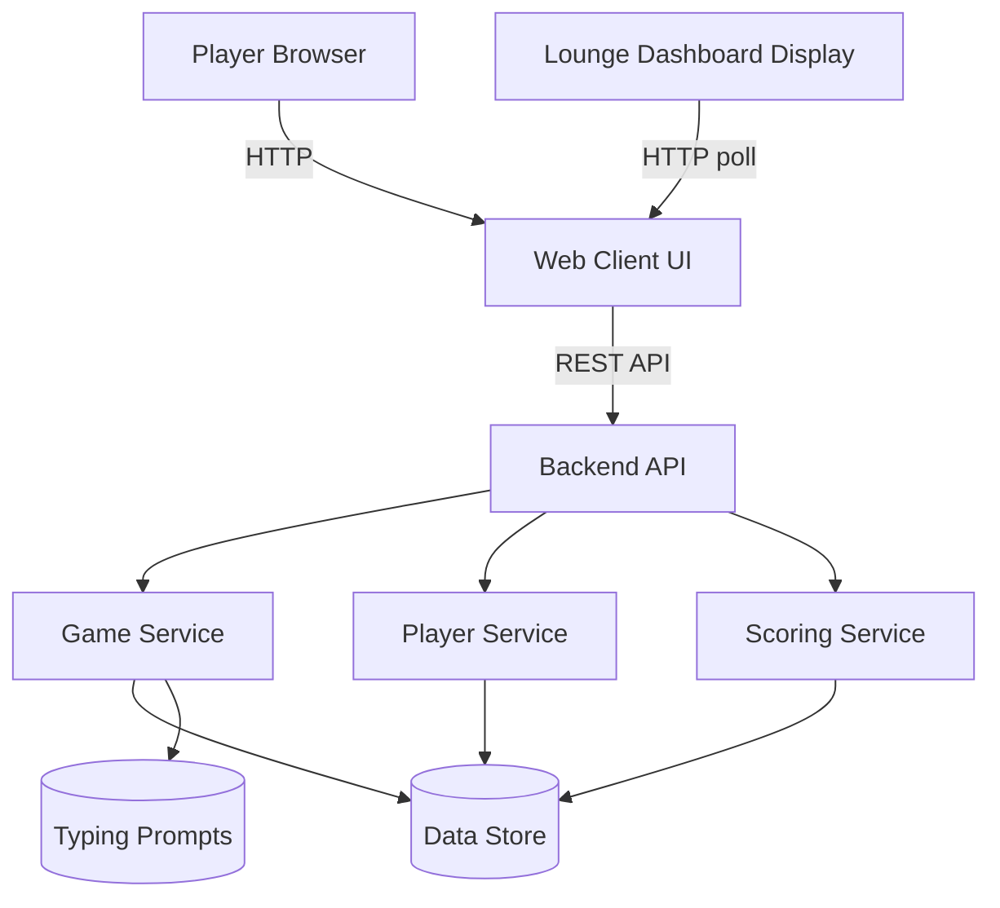
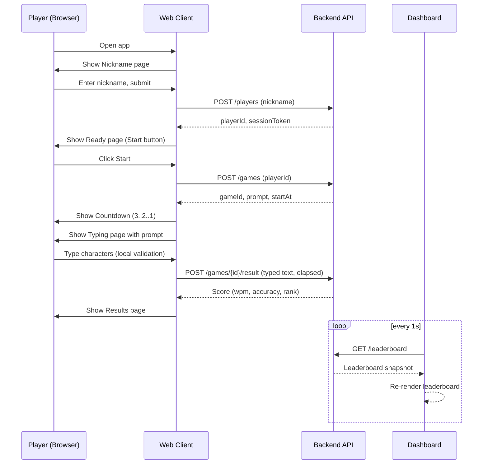

# Design Document: Typing Game

## Overview

The Typing Game is a multi-user, lounge-style web application designed for casual, social play. Participants identify themselves with a nickname or alias, then compete in a timed typing challenge where a passage of text must be typed as quickly and accurately as possible. A shared dashboard displays a live leaderboard so players can see how they rank against others in the lounge.

The system is optimized for a walk-up, low-friction experience: no accounts, no passwords, just a nickname and a start button. The architecture favors a simple web client talking to a lightweight backend with a shared real-time dashboard view, making it well-suited for deployment on a single screen in a lounge while players join from their own devices (or a shared kiosk).

This design focuses on the high-level architecture, component responsibilities, interface contracts, and data models. Low-level algorithms, function signatures, and implementation details are intentionally left for a follow-up design pass.

## Architecture

The application is structured as a classic client-server web app. Players interact with a browser-based client that walks them through the game flow, while the backend manages sessions, game state, scoring, and the shared leaderboard. The dashboard view keeps itself current by polling the leaderboard endpoint once per second.

Key architectural choices:

- A single web client serves both the player flow (nickname → ready → countdown → typing → results) and the dashboard view, selected by route.
- The backend exposes a small REST API for lifecycle actions (register player, start game, submit result) and for leaderboard reads.
- The Dashboard_Client polls `GET /leaderboard` every second to keep its view current; no push channel is used.
- Game state, players, and scores live in a shared data store so the leaderboard stays consistent across all connected clients.
- Typing prompts are sourced from a simple prompt repository (can start as a static list and grow into a managed collection).

## Game Flow

The primary user journey from walk-up to final score.

## Components and Interfaces

### Component 1: Web Client (Player UI)

Purpose: Guides a single player through the end-to-end game flow in the browser.

Responsibilities:
- Render the Nickname, Ready, Countdown, Typing, and Results pages.
- Validate nickname input on the client (length, allowed characters).
- Drive the countdown timer and the typing session timer.
- Capture keystrokes, provide real-time visual feedback (correct/incorrect characters), and submit the final result.
- Handle error states (network failure, duplicate nickname, expired session).

Interface (conceptual):
- Route: `/` — Nickname entry
- Route: `/ready` — Start button
- Route: `/play/:gameId` — Countdown + typing challenge
- Route: `/results/:gameId` — Player's own result summary

### Component 2: Dashboard Client

Purpose: Shared, read-only view intended for a lounge display showing the live leaderboard.

Responsibilities:
- Fetch `GET /leaderboard` on mount for an initial snapshot.
- Poll `GET /leaderboard` once per second while mounted, re-rendering from each successful snapshot.
- Render the current top-N leaderboard (nickname, WPM, accuracy, score).
- Tolerate transient failures by keeping the last successful snapshot on screen until the next successful poll.

Interface (conceptual):
- Route: `/dashboard` — Live leaderboard view

### Component 3: Backend API

Purpose: Single entry point for all client actions. Coordinates the underlying services.

Responsibilities:
- Expose REST endpoints for player registration, game lifecycle, result submission, and leaderboard reads.
- Authenticate requests via short-lived session tokens tied to a nickname.

Interface (REST, conceptual):
- `POST /players` — Register a nickname, returns player identity and session token.
- `POST /games` — Start a new game for a player, returns game id and assigned prompt.
- `POST /games/{gameId}/result` — Submit the final typed text and elapsed time, returns computed score and rank.
- `GET /leaderboard` — Fetch the current leaderboard snapshot (polled by the Dashboard_Client).
- `GET /games/{gameId}` — Fetch game metadata (prompt, status).

### Component 4: Game Service

Purpose: Owns the lifecycle of a typing game instance.

Responsibilities:
- Create games, assign a prompt, and track status (pending, in-progress, completed, abandoned).
- Enforce per-game constraints (single active game per player, maximum duration).
- Persist game records and notify the scoring service upon completion.

### Component 5: Player Service

Purpose: Manages nickname-based player identities for the current lounge session.

Responsibilities:
- Register and look up players by nickname.
- Enforce nickname uniqueness within an active lounge session (configurable policy).
- Issue and validate short-lived session tokens.

### Component 6: Scoring Service

Purpose: Computes the score for a completed game and updates the leaderboard.

Responsibilities:
- Compute words-per-minute (WPM) and accuracy from submitted text and elapsed time.
- Derive an overall score used for ranking.
- Persist the Score; subsequent `GET /leaderboard` reads recompute the snapshot from the Score table.

### Component 7: Prompt Repository

Purpose: Supplies typing prompts to the Game Service.

Responsibilities:
- Return a prompt (by random selection, difficulty, or rotation policy).
- Allow prompts to be added or edited (initially can be a static seeded list).

## Data Models

### Model 1: Player

Represents a participant identified by nickname for the current lounge session.

Fields:
- `id` — Unique player identifier.
- `nickname` — Display name chosen by the player.
- `createdAt` — Timestamp when the player registered.
- `sessionToken` — Short-lived token used to authorize subsequent actions.

Validation Rules:
- Nickname length between 2 and 20 characters.
- Nickname limited to letters, digits, spaces, hyphens, and underscores.
- Nickname must be unique among currently active players (case-insensitive).

### Model 2: Prompt

Represents a piece of text to be typed during a game.

Fields:
- `id` — Unique prompt identifier.
- `text` — The passage to type.
- `difficulty` — Optional category (e.g., easy, medium, hard).
- `language` — Language code of the text.

Validation Rules:
- Text is non-empty and within a reasonable length range (e.g., 100–500 characters).
- Difficulty, if present, is one of a fixed set of values.

### Model 3: Game

Represents a single attempt by a player to type a prompt.

Fields:
- `id` — Unique game identifier.
- `playerId` — Reference to the participating player.
- `promptId` — Reference to the assigned prompt.
- `status` — One of `pending`, `in_progress`, `completed`, `abandoned`.
- `startedAt` — Timestamp when the typing phase began (after countdown).
- `endedAt` — Timestamp when the result was submitted or the game expired.

Validation Rules:
- A player may have at most one `in_progress` game at a time.
- `endedAt` must be later than `startedAt` when present.
- Status transitions follow: `pending → in_progress → completed` or `pending/in_progress → abandoned`.

### Model 4: Score

Represents the computed outcome of a completed game.

Fields:
- `id` — Unique score identifier.
- `gameId` — Reference to the game.
- `playerId` — Reference to the player (denormalized for fast leaderboard reads).
- `wpm` — Words per minute.
- `accuracy` — Percentage of correctly typed characters.
- `points` — Composite score used for ranking.
- `createdAt` — Timestamp when the score was recorded.

Validation Rules:
- `wpm >= 0`, `accuracy` in `[0, 100]`.
- `points` is derived deterministically from `wpm` and `accuracy`.
- Exactly one Score per completed Game.

### Model 5: LeaderboardEntry (Derived)

Represents a row rendered on the dashboard.

Fields:
- `playerId`
- `nickname`
- `bestWpm`
- `bestAccuracy`
- `bestPoints`
- `rank`

Validation Rules:
- Derived from Scores; not independently writable.
- Ranking is by `bestPoints` descending, ties broken by `bestWpm`, then earliest `createdAt`.

## Error Handling

### Error Scenario 1: Duplicate Nickname

- Condition: A player submits a nickname already in use by an active player.
- Response: API returns a conflict response indicating the nickname is taken; client shows an inline message and keeps the user on the Nickname page.
- Recovery: Player picks a different nickname and resubmits.

### Error Scenario 2: Session Token Invalid or Expired

- Condition: A request carries a missing, unknown, or expired session token.
- Response: API returns an unauthorized response; client clears local state.
- Recovery: Client redirects back to the Nickname page to re-register.

### Error Scenario 3: Game Already In Progress

- Condition: Player attempts to start a new game while one is already `in_progress`.
- Response: API returns a conflict response including the existing `gameId`.
- Recovery: Client routes the player into the existing game, or offers to abandon and restart.

### Error Scenario 4: Result Submitted After Timeout

- Condition: A result arrives after the server-side maximum game duration has elapsed.
- Response: Server marks the game as `abandoned` and rejects the submission.
- Recovery: Client shows a "time's up" message and returns the player to the Ready page.

### Error Scenario 5: Network Loss During Typing

- Condition: Client loses connectivity mid-game.
- Response: Client continues the local timer and buffers the result; on reconnection it submits.
- Recovery: If the server has already marked the game abandoned, client surfaces the error and offers a new game.

### Error Scenario 6: Dashboard Poll Failure

- Condition: A single `GET /leaderboard` poll from the Dashboard_Client fails (network blip or transient server error).
- Response: Dashboard keeps the last successfully rendered snapshot on screen.
- Recovery: The next scheduled poll (one second later) retries; on success the snapshot is replaced.

## Correctness Properties

*A property is a characteristic or behavior that should hold true across all valid executions of a system-essentially, a formal statement about what the system should do. Properties serve as the bridge between human-readable specifications and machine-verifiable correctness guarantees.*

### Property 1: Nickname validation matches the stated rules

*For any* input string, the Player_Service's accept/reject decision SHALL match the stated nickname rules: accept if and only if the string has length in `[2, 20]`, contains only letters, digits, spaces, hyphens, or underscores, and does not case-insensitively match any current Active_Player's nickname.

**Validates: Requirements 1.5, 1.6, 1.7**

### Property 2: Successful registration produces a well-formed Player and bound Session_Token

*For any* nickname accepted by the validator, the Player_Service SHALL produce a Player record with a unique `id`, the submitted `nickname`, a `createdAt` timestamp, and a newly issued `sessionToken` that resolves to exactly that `playerId`.

**Validates: Requirements 1.3, 7.1**

### Property 3: Session token authorization on protected endpoints

*For any* request to `POST /games`, `POST /games/{gameId}/result`, or any other protected endpoint, the Backend_API SHALL reject the request with an unauthorized response if and only if the supplied Session_Token is missing, unknown, or past its bounded lifetime.

**Validates: Requirements 7.2, 7.3, 7.5**

### Property 4: WPM is non-negative

*For any* completed Game with server-measured elapsed time greater than zero and any submitted typed text, the Scoring_Service SHALL compute `wpm >= 0`.

**Validates: Requirement 4.1**

### Property 5: Accuracy is in [0, 100]

*For any* completed Game and any submitted typed text, the Scoring_Service SHALL compute `accuracy` in the closed interval `[0, 100]`.

**Validates: Requirement 4.2**

### Property 6: Points derivation is deterministic

*For any* `(wpm, accuracy)` pair, the Scoring_Service SHALL compute the same `points` value on every invocation (idempotent/deterministic derivation).

**Validates: Requirement 4.3**

### Property 7: Server-authoritative timing

*For any* result submission, the Scoring_Service's computed Score SHALL depend only on the typed text, the Game's prompt, and the server-measured elapsed time `endedAt - startedAt`, and SHALL be invariant under any change to the client-supplied elapsed value.

**Validates: Requirements 3.6, 15.1, 15.2**

### Property 8: Exactly one Score per completed Game with consistent end state

*For any* sequence of result submissions for a Game, once the Game reaches status `completed` there SHALL be exactly one persisted Score referencing that `gameId`, the Game's status SHALL be `completed`, and `endedAt > startedAt`.

**Validates: Requirements 4.4, 4.5, 8.3, 8.7**

### Property 9: Leaderboard aggregation invariant

*For any* set of persisted Scores, the derived Leaderboard SHALL contain exactly one LeaderboardEntry per Player who has at least one Score, and each entry's `bestPoints`, `bestWpm`, and `bestAccuracy` SHALL equal the maximum of the corresponding values across that Player's Scores.

**Validates: Requirements 5.1, 5.2**

### Property 10: Leaderboard ordering and rank invariant

*For any* set of persisted Scores, the Leaderboard SHALL be ordered by `bestPoints` descending with ties broken by `bestWpm` descending and then by earliest Score `createdAt` ascending, and the `rank` values SHALL form the contiguous sequence `1, 2, ..., N` in that order.

**Validates: Requirements 5.3, 5.4**

### Property 11: Leaderboard update reflects new Scores (metamorphic)

*For any* Game that transitions to `completed`, the snapshot returned by `GET /leaderboard` after the Score is persisted SHALL include a LeaderboardEntry for that Player whose `bestPoints`, `bestWpm`, and `bestAccuracy` are at least the values of the newly persisted Score.

**Validates: Requirement 5.6**

### Property 12: Game state machine only allows defined transitions

*For any* sequence of lifecycle events applied to a Game, the resulting status sequence SHALL contain only transitions drawn from `pending → in_progress`, `in_progress → completed`, `pending → abandoned`, and `in_progress → abandoned`, starting from initial status `pending`.

**Validates: Requirements 8.1, 8.2, 8.3, 8.4, 8.5**

### Property 13: At most one in-progress game per player

*For any* Player and any interleaving of game creation, transition, and submission events, the number of Games with status `in_progress` referencing that Player SHALL be at most one at any instant, and `POST /games` SHALL return a conflict response including the existing `gameId` whenever the Player already has one.

**Validates: Requirements 2.6, 8.6**

### Property 14: Game timeout enforcement

*For any* `in_progress` Game whose server-measured elapsed time exceeds Maximum_Game_Duration, the Game_Service SHALL transition the Game's status to `abandoned`, and any `POST /games/{gameId}/result` arriving after that point SHALL be rejected.

**Validates: Requirements 9.1, 9.2, 9.4**

### Property 15: Prompt validity

*For any* Prompt stored in the Prompt_Repository, the record SHALL have a unique `id`, a non-empty `text` whose length is in `[100, 500]` characters, a `language` code, and, if a `difficulty` is present, a `difficulty` value drawn from the allowed fixed set.

**Validates: Requirements 11.2, 11.3, 11.4**

### Property 16: Dashboard render contains required fields

*For any* Leaderboard snapshot, the Dashboard_Client's rendered top-N rows SHALL include the `nickname`, `bestWpm`, `bestAccuracy`, and `bestPoints` for each displayed LeaderboardEntry.

**Validates: Requirement 6.1**

### Property 17: Safe rendering of untrusted text

*For any* nickname or typed content, the Web_Client and Dashboard_Client SHALL render the text in a manner that does not allow the content to be interpreted as executable HTML or script.

**Validates: Requirements 13.1, 13.2**

### Property 18: Rate-limited endpoints reject over-limit requests without side effects

*For any* sequence of requests to `POST /players` or `POST /games` that exceeds the configured rate limit, the Backend_API SHALL respond with a rate-limit-exceeded response for the over-limit requests and SHALL NOT create a Player or Game record as a result of those requests.

**Validates: Requirements 14.1, 14.2, 14.3**

### Property 19: Player record is limited to the data model

*For any* registered Player, the persisted record SHALL contain only the fields defined in the Player data model (`id`, `nickname`, `createdAt`, `sessionToken`) and SHALL NOT contain additional personal data fields.

**Validates: Requirements 16.1, 16.2**

## Testing Strategy

### Unit Testing Approach

- Validate each service in isolation: player registration rules, game state transitions, scoring computation inputs/outputs, and leaderboard ranking.
- Cover validation rules for every data model (nickname format, prompt bounds, game status transitions, score ranges).
- Exercise error paths for each API endpoint (duplicate nickname, invalid token, concurrent game, late submission).
- Target high coverage on services that encode game rules, since they are the source of user-visible behavior.

### Property-Based Testing Approach

Use property-based tests to strengthen confidence in rule-heavy areas:

- Scoring: for any valid typed text and elapsed time, `accuracy` is in `[0, 100]` and `wpm >= 0`.
- Leaderboard ordering: for any set of scores, the produced leaderboard is sorted by `points` descending with the documented tie-breakers.
- Game state machine: for any sequence of lifecycle events, only valid status transitions occur.
- Nickname validation: for any string, the validator's accept/reject decision matches the stated rules.

Property Test Library: to be selected based on the chosen implementation stack (e.g., fast-check for JS/TS, Hypothesis for Python).

### Integration Testing Approach

- End-to-end flow: register player → start game → submit result → `GET /leaderboard` reflects the new Score.
- Dashboard polling: verify the dashboard UI updates within one polling interval after a game completes.
- Concurrency: multiple players registering and playing simultaneously produce consistent leaderboard results.
- Failure injection: simulate expired tokens, timeouts, and transient poll failures and verify documented recovery behavior.

## Performance Considerations

- The lounge scenario implies modest concurrent load (tens of players), so vertical scaling of a single backend instance is acceptable for v1.
- Leaderboard reads recompute the snapshot from the Scores table on each `GET /leaderboard`. Each dashboard client issues one poll per second; at lounge scale (tens of players, hundreds of scores at most per session) a per-request SQL aggregation is cheap enough that no cache is warranted.
- Dashboard updates should appear within one poll interval (~1 second) of a game completion to feel "live".
- Typing-page interactions must feel instantaneous; avoid server round-trips per keystroke and keep per-character validation local to the client.

## Security Considerations

- Session tokens are short-lived and scoped to a single nickname; they are not a substitute for real authentication and should not be used to access sensitive data.
- Input sanitation is required for nicknames and typed content before they are rendered on the dashboard to prevent injection or display issues.
- Rate-limit player registration and game creation endpoints to prevent trivial abuse (e.g., nickname flooding).
- Server is the source of truth for game start time and elapsed time; do not trust client-supplied timings for scoring.
- No personal data beyond a freely chosen nickname is collected.

## Dependencies

- A web frontend framework of choice for the client and dashboard UI.
- A backend framework capable of serving REST endpoints.
- A data store for players, games, scores, and prompts (a lightweight relational or document store is sufficient for v1).
- A seed list of typing prompts suitable for casual play.
